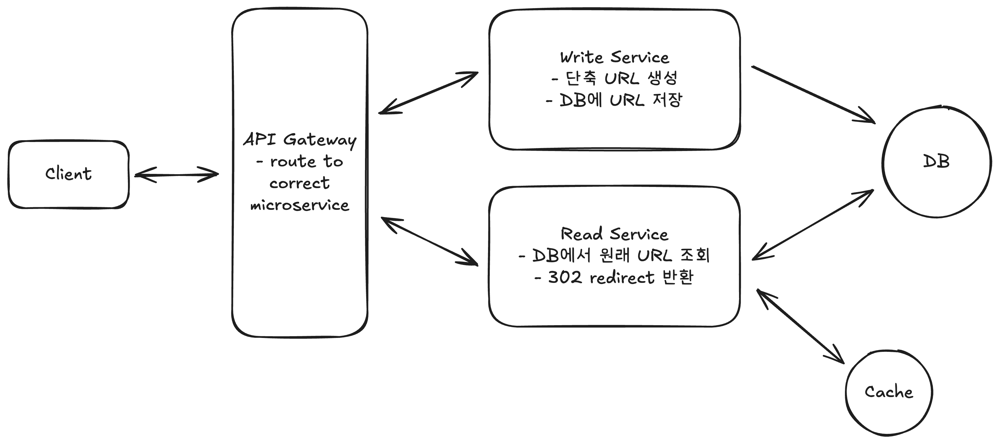

# Design Document - Bitly-Hana

Bitly 시스템 설계 및 개선

-   Authors: 조하나
-   Project: 시스템 딥 다이브 - Bitly
-   Last updated: 2025-09-20
-   Target readers: System-Deep-Dive 팀원들

## Context and scope

시스템 설계 스터디에서 시스템 설계 지식 습득 및 실습을 위해 진행하는 프로젝트로, 웹사이트 URL 단축기를 구현할 때의 시스템 설계를 심층 분석해 개선 방안을 고민하고 실습해봄.

URL 단축기는 외부 웹 URL을 단축시키고 해당 단축 URL로 접속 시 원래 웹사이트로 리다이렉트 시키는 기능을 제공함. 이 시스템의 읽기/쓰기 비율은 읽기에 크게 치우쳐있음. 새로운 단축 URL이 생성(쓰기)될 때마다 1,000회의 클릭(읽기)이 발생할 수 있음. 이러한 불균형을 가장 중요한 고려 사항으로 정의하고, 리디렉션의 낮은 지연시간(<= 100ms)을 달성하는 것이 핵심 목표임.

따라서 본 프로젝트는 데이터베이스 풀스캔, 인덱싱, Redis와 같은 인메모리 캐시를 도입하여 각 방식에 대한 차이점과 지연 속도를 비교하는 방식으로 효율 개선을 학습하고, 최종적으로는 데이터베이스 접근을 최소화하고 리디렉션 속도를 극대화하는 데 중점을 둠.

## Goals and non-goals

이 시스템을 통하여 달성하고자 하는 목표는 다음과 같음.

-   **리디렉션 지연 시간 최소화**: 짧은 URL을 통한 원래 URL로의 리디렉션의 낮은 지연 속독 100ms 미만으로 이루어져야함.
-   **캐시 활용 극대화**: 빈번하게 접근되는 URL 매핑 정보를 메모리 내 캐시에 저장하여 데이터베이스 부하를 줄이고 읽기 성능을 향상시킴.
-   **캐시 효율성**: LRU(Least Recently Used) 제거 정책을 구현하여 가장 최근에 사용되지 않은 항목을 효율적으로 관리하고, 캐시 워밍업 시간을 고려함.
-   **고가용성 정보**: 캐시 시스템이 다운되더라도 서비스가 계속 운영될 수 있도록 설계함

이 시스템은 다음과 같은 것들은 목표로 하지 않고 구현 범위에서 제외함.

-   **사용자 인증 및 계정 관리**: URL 단축 시스템의 핵심을 벗어난 기능.
-   **클릭 통계 및 분석**: 리디렉션 시의 클릭 로그에 대한 실시간 분석 및 대시보드 구현.
-   **고급 보안 기능**: 스팸 감지 및 악성 URL 필터링과 같은 고급 보안 기능.
-   **CDN/엣지 컴퓨팅 구현**: 추가적인 성능 최적화 방안으로 논의될 수 있으나 주된 초점이 되는 ‘메모리 내 캐시’ 구현에 집중하기 위해 직접적인 구현은 제외함.

## Detailed design

### System-context-diagram (relationship to other systems)



### APIs

시스템은 다음과 같은 주요 API가 설계됨.

1. **URL단축**: 긴 URL을 받아 짧은 URL을 생성하고 반환함.

    ```
    POST /urls -> shortUrl
    {
        originalUrl,
    }
    ```

2. **리디렉션**: HTTP 302 Found 상태코드와 함께 Location 헤더에 원래 URL을 포함하여 리디렉션함.

    ```
    GET /{short_code} -> 302 리디렉션
    ```

### Data storage

시스템의 핵심 엔티티와 데이터 저장 전략은 다음과 같음.

핵심 엔티티:

-   **Original URL**: 사용자가 단축하고자 하는 원본의 긴 URL.
-   **Short URL**: 사용자에게 제공되는 단축된 URL

데이터 저장 전략:

1. **주 데이터베이스 (PostgreSQL)**

-   단일 인스턴스로 10억 개의 URL 저장 및 관리가 가능함.
-   대부분의 읽기 처리량은 캐시에서 처리되므로 데이터베이스 자체의 읽기 부하는 높지 않음.

2. **인메모리 캐시 (Redis)**

-   **저장 내용**: short_code(키)와 long_url의 매핑.
-   **목적**: 데이터베이스 접근을 최소화하고 리디렉션 요청의 지연 시간을 극적으로 줄임.

## Alternatives considered: 대안적 고려사항

URL 단축기의 핵심 목표는 **낮은 지연 시간(≤100ms)** 과 **읽기 중심 트래픽(1:1000 비율)의 효율적 처리**입니다. 이를 달성하기 위해 여러 대안적 설계를 고려할 수 있으며, 각 접근 방식의 장단점은 다음과 같습니다.

### 1. 데이터베이스 풀 스캔 (Full Table Scan)

-   **설명**: 단축 URL 요청이 들어올 때마다 데이터베이스 전체를 탐색하여 원본 URL을 조회.
-   **장점**: 구현이 매우 단순하며 별도 인프라가 필요 없음.
-   **단점**: 데이터가 커질수록 조회 시간이 선형적으로 증가 → 지연 시간 100ms 미만 달성 불가능. 대규모 트래픽 환경에서는 서비스 불가.
-   **결론**: 실험적 비교는 가능하나, 실제 서비스에는 부적합.

### 2. 데이터베이스 인덱싱 (Indexing with B-Tree/Hash)

-   **설명**: 단축 URL 컬럼에 인덱스를 생성하여 빠른 조회 지원.
-   **장점**: 대부분의 관계형 DB에서 기본적으로 지원. 조회 성능이 크게 향상되어 O(log N) 수준으로 단축 가능.
-   **단점**: 여전히 DB I/O 비용이 존재하며, 초당 수천~수만 건의 요청이 들어올 경우 DB 부하가 집중됨. 스케일아웃(샤딩/리플리카) 필요성이 발생.
-   **결론**: 단일 서버나 소규모 트래픽에는 충분히 유효하나, 고트래픽 환경에서는 병목이 발생.

### 3. 애플리케이션 레벨 캐시 (In-Memory Map, e.g., HashMap/Guava Cache)

-   **설명**: 서버 메모리에 단축 URL → 원본 URL 매핑을 보관.
-   **장점**: 메모리 접근은 마이크로초 단위로 매우 빠름. 단일 서버 환경에서는 DB 접근을 거의 제거할 수 있음.
-   **단점**: 서버 인스턴스가 여러 개일 경우 캐시 불일치(inconsistency) 문제 발생. 서버 재시작 시 캐시 유실. 대규모 분산 환경에서는 한계가 있음.
-   **결론**: 소규모 서비스에는 적합하지만, 확장성과 고가용성이 필요한 본 프로젝트의 목표와는 거리가 있음.

### 4. 분산 캐시 시스템 (Redis, Memcached 등)

-   **설명**: 단축 URL 매핑 정보를 Redis 같은 인메모리 캐시 서버에 저장하고, 요청 시 캐시에서 우선 조회.
-   **장점**: 네트워크 레벨에서 빠른 응답(수 ms). 다중 서버 환경에서도 일관성 유지 가능. TTL, LRU 정책을 활용해 메모리 관리 용이. 캐시 미스 시 DB 조회 후 캐시에 저장하는 구조로 DB 부하 최소화 가능.
-   **단점**: 별도 인프라 운영 필요(운영 복잡성 증가). 캐시 서버 장애 시 DB로 fallback 필요. 초기 워밍업 비용 존재.
-   **결론**: 읽기 트래픽이 압도적으로 많은 URL 단축기 특성에 최적. 본 프로젝트의 핵심 목표(100ms 이하 지연, DB 부하 최소화)를 달성하는 데 가장 적합한 솔루션.
